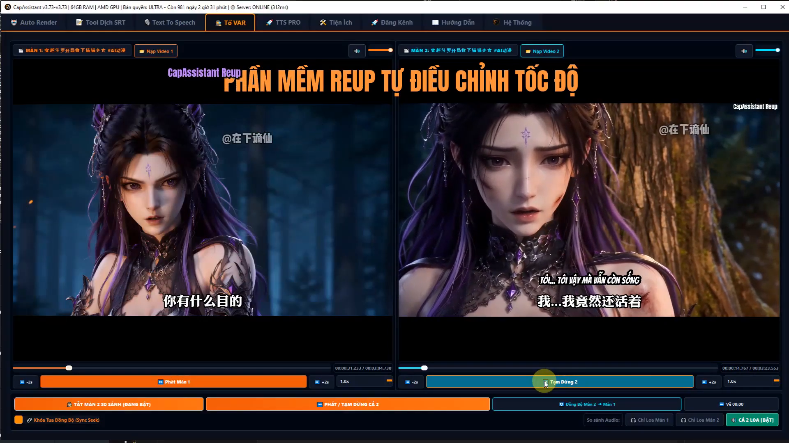
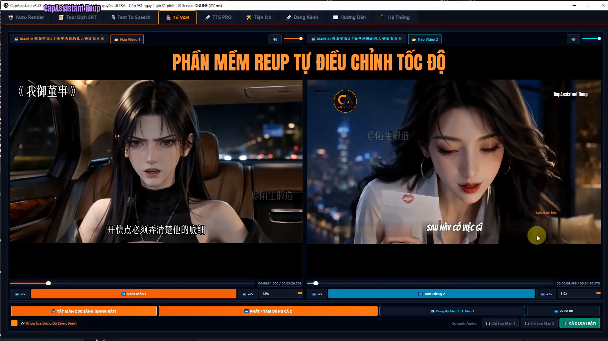
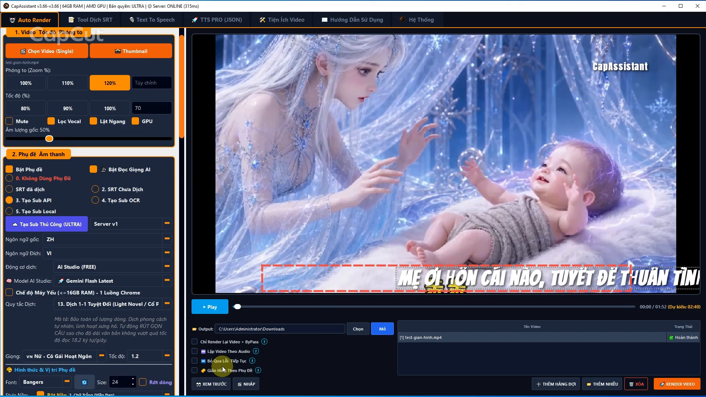
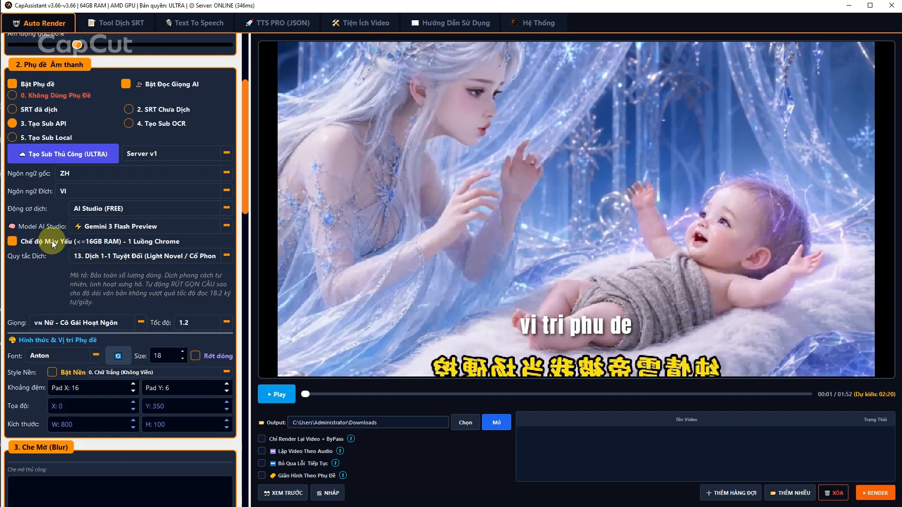
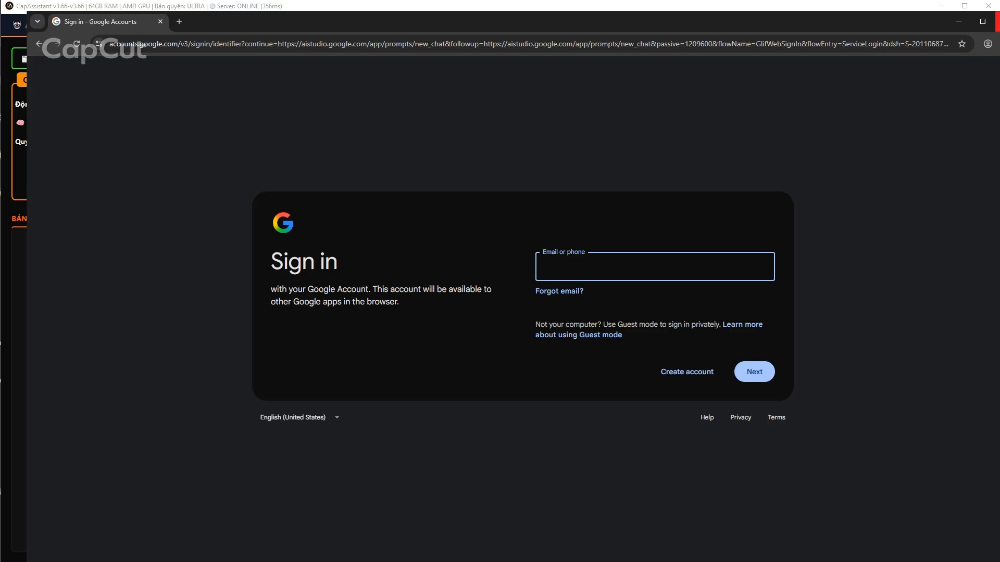
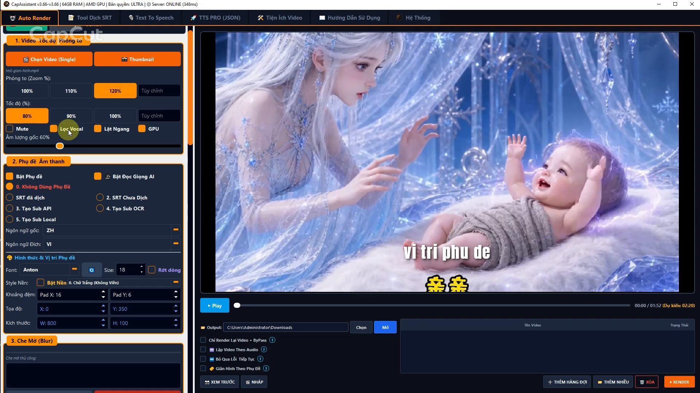
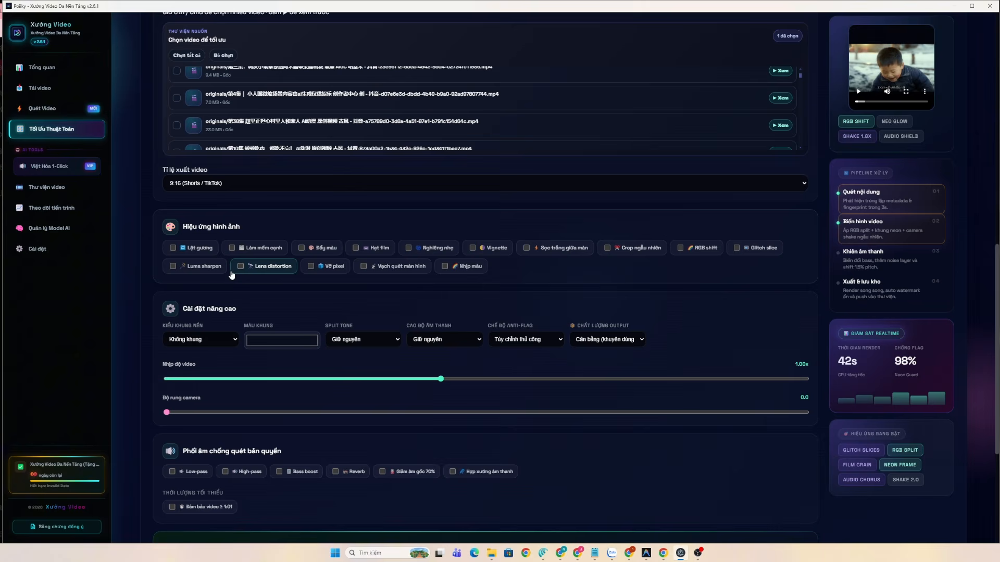
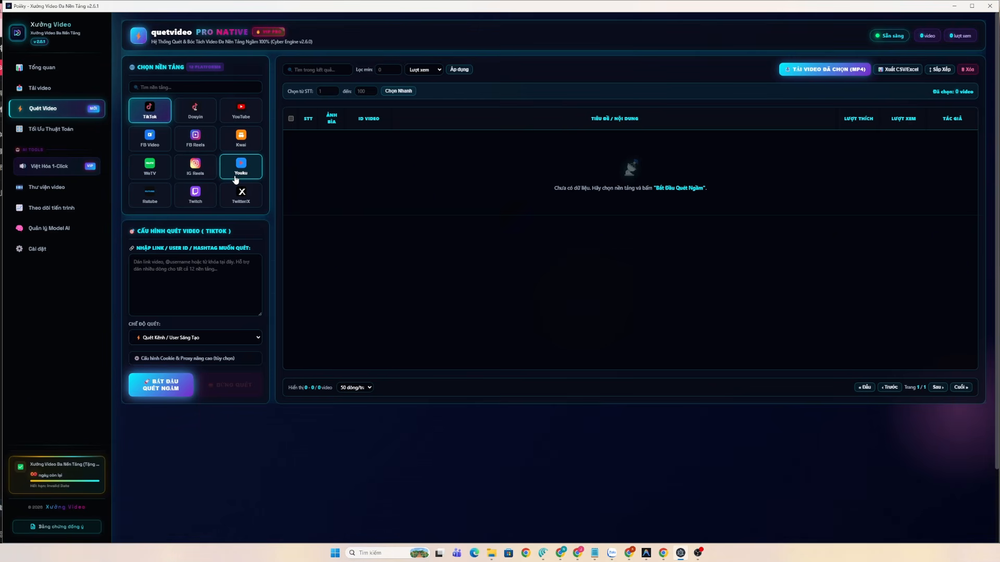
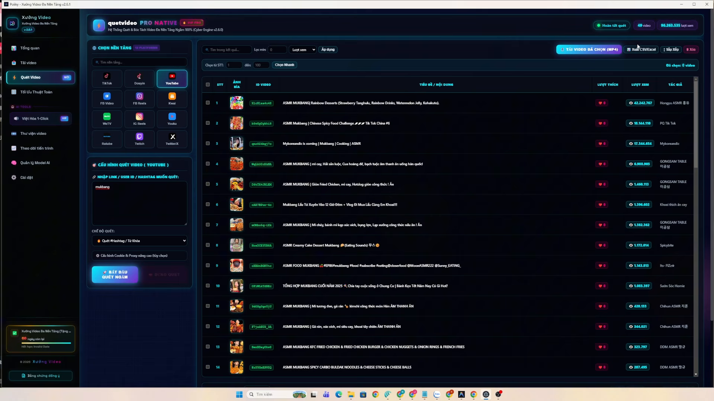

# Đặc Tả Kiến Trúc & Chiến Lược Nâng Cấp Douyinie: Học Hỏi Từ Poiiky v2.6.1 & CapAssistant v3.73

- **Trạng thái**: Draft / Đề xuất nâng cấp kiến trúc toàn diện
- **Tài liệu tham chiếu**:
  - `docs/diagrams/douyinie-architecture.json` (Kiến trúc chuẩn Douyinie Phase 1)
  - `docs/research/issue119-douyin-discovery-provider-strategy-2026-09-19.md` (Chiến lược Provider Discovery)
  - `docs/assets/poiiky/` (Bộ 18 screenshot giao diện và phân tích kỹ thuật Poiiky v2.6.1)
  - `docs/assets/capassistant/` (Bộ 23 screenshot giao diện và phân tích kỹ thuật CapAssistant v3.66 - v3.73)
- **Tác giả / Phân tích**: Trợ lý Kỹ thuật Douyinie & Gemini-3.8-Flash Gateway

---

## 1. Tổng Quan & Bối Cảnh Thực Chiến

Douyinie đã xây dựng một nền móng **chuẩn phòng thu** rất vững chắc:
- Tách giọng nói đa nhân vật (`CAM++ / 3D-Speaker Diarization`).
- Tách nhạc nền & vocal chất lượng cao (`Demucs / UVR`).
- Nhận diện và **xóa/inpaint phụ đề gốc Trung Quốc triệt để 100%** (`PaddleOCRv6` + Otsu glyph ink refinement + localized inpainting).
- Dịch thuật chất lượng cao qua Remote LLM Gateway (`gemini-3.8-flash` $\to$ `deepseek-v4.1-flash`).
- Lồng tiếng đa giọng theo từng speaker (`ZeroTTS` + `CosyVoice3` escalation).
- Cổng kiểm duyệt chất lượng nghiêm ngặt (`Review Gate` / Seam 1 & Seam 2).

Tuy nhiên, khi đối chiếu với 2 phần mềm Reup/Bán content hàng đầu thị trường hiện nay:
1. **Poiiky v2.6.1**: Chuyên về **Săn/Cào video đa nền tảng (Acquisition Crawler)** và **Bộ lọc lách bản quyền thuật toán (Anti-Detection Reup Engine)**.
2. **CapAssistant v3.66 - v3.73**: Chuyên về **Công nghệ Tổ VAR (Dual-player review & sync seek)**, **Thuật toán co giãn video theo phụ đề (Dynamic Video Stretch)**, **15 quy tắc dịch thuật khống chế tốc độ đọc (18.2 ký tự/giây)**, và **Cơ chế dịch Gemini Free qua Headless Chrome**.

Douyinie có thể dung nạp toàn bộ tinh hoa của cả 2 phần mềm này để trở thành siêu công cụ tự động hóa hoàn hảo nhất.

---

## 2. Phân Hệ 1: Công Nghệ "Tổ VAR" (Dual-Player Review Room)

Lấy cảm hứng trực tiếp từ tính năng độc quyền của **CapAssistant**:


*Hình 1: Giao diện Tổ VAR (Màn 1: Video gốc vs Màn 2: Video Reup/Thành phẩm) chạy song song.*


*Hình 2: Tua timeline đồng bộ (Sync Seek) và công tắc chuyển đổi kênh âm thanh (Loa 1 / Loa 2 / Cả 2 loa).*

### 2.1 Cơ chế hoạt động của Tổ VAR
- **Dual-Player Video Synchronizer**: Chạy 2 trình phát video song song trên WebUI:
  - *Màn 1*: Video gốc tiếng Trung (hoặc video sau tách vocal).
  - *Màn 2*: Video thành phẩm (đã inpaint xóa chữ, gắn phụ đề tiếng Việt và lồng tiếng AI).
- **Khóa Tua Đồng Bộ (Sync Seek)**: Khi operator kéo thanh timeline ở Màn 1 hoặc Màn 2, player còn lại tự động nhảy đến đúng timestamp tương ứng.
- **Bộ Kiểm Âm Đa Kênh (Audio Channel Switcher)**:
  - `Chỉ Loa Màn 1`: Nghe riêng thoại gốc tiếng Trung.
  - `Chỉ Loa Màn 2`: Nghe riêng giọng lồng tiếng Việt và nhạc nền mới.
  - `Cả 2 Loa [BẬT]`: Bật đồng thời cả 2 kênh để nghe độ lệch pha (phase delay), kiểm tra giọng đọc tiếng Việt có bị nói quá sớm hoặc quá trễ so với khẩu hình của nhân vật hay không.
- **Đối soát phụ đề song ngữ (Bilingual Subtitle Inspector)**: Hiển thị song song câu thoại gốc Trung Quốc và câu dịch tiếng Việt để operator bấm sửa trực tiếp nếu câu dịch bị sai nghĩa.

### 2.2 Đề xuất tích hợp vào Douyinie (`web/` & `internal/service/review.go`)
Hiện tại Douyinie đã có `ReviewService` và Seam 1 API. Chúng ta sẽ nâng cấp tab **Review Inspector** trên WebUI thành **Phòng Kiểm Duyệt Tổ VAR**:
- Endpoint: `GET /api/v1/runs/{id}/review/var-stream` trả về stream URL của SourceAsset và RenderedAsset.
- Frontend: Tích hợp 2 thẻ `<video>` đồng bộ timeupdate event, hỗ trợ phím tắt `Space` (Play/Pause cả 2), `J`/`L` (lùi/tiến 1 frame hoặc 2 giây).

---

## 3. Phân Hệ 2: Thuật Toán Co Giãn Video Theo Phụ Đề (Video Stretch)

Đây là **"vũ khí bí mật"** giải quyết triệt để bài toán muôn thuở của lồng tiếng video:


*Hình 3: Tùy chọn "Giãn Hình Theo Phụ Đề" trên CapAssistant giúp khớp khẩu hình và câu thoại.*

### 3.1 Vấn đề nan giải hiện tại của Douyinie
- Tiếng Việt thường có độ dài âm tiết dài hơn tiếng Trung khoảng 15% - 30%.
- Trong Douyinie, invariant chuẩn phòng thu là: `non-1.0 speed fails closed, overrun remediation is rewrite/regroup/review`.
- Khi câu lồng tiếng Việt dài hơn khoảng trống đối thoại (dialogue gap), `AudioMixService.MixAudio` sẽ từ chối (`ErrMixerOverrunRefused`) và đẩy vào hàng đợi review để người dùng viết lại câu ngắn hơn.

### 3.2 Giải pháp "Giãn Hình Theo Phụ Đề" (Dynamic Time-Warping)
Thay vì ép giọng đọc AI phải nói quá nhanh (nghe như bị giục) hoặc làm chậm toàn bộ video, thuật toán này hoạt động cục bộ:
1. **Phân tích Overrun**: Với mỗi phân đoạn thoại $i$, tính độ chênh lệch thời gian:
   $$\Delta t = \text{Duration}(\text{TTS}_i) - \text{Duration}(\text{OriginalGap}_i)$$
2. **Nếu $\Delta t \le 0$**: Giữ nguyên 100% tốc độ video tại phân đoạn đó.
3. **Nếu $\Delta t > 0$ (TTS dài hơn video gốc)**:
   - Áp dụng bộ lọc FFmpeg `setpts` hoặc Motion Interpolation (`minterpolate`) làm chậm video cục bộ tại đúng phân cảnh đó:
     $$\text{PTS}_{\text{new}} = \text{PTS} \times \left(1 + \frac{\Delta t}{\text{Duration}(\text{OriginalGap}_i)}\right)$$
   - Hoặc chèn freeze-frame / lặp frame thông minh ở các đoạn chuyển cảnh tĩnh.
4. **Kết quả**: Video tự động kéo dài đúng bằng câu thoại của AI, hình ảnh chuyển động mượt mà không bị giật, người xem không hề nhận ra video đã được kéo dài.

---

## 4. Phân Hệ 3: 15 Quy Tắc Dịch Thuật & Khống Chế Tốc Độ Đọc (18.2 Ký Tự/Giây)


*Hình 4: 15 Quy tắc dịch thuật chuyên sâu của CapAssistant (Light Novel, Cổ phong, Đô thị, Review phim).*

### 4.1 Quy tắc cốt lõi: Rút gọn câu theo ngân sách tốc độ đọc
CapAssistant định nghĩa công thức vàng tại Quy tắc 13:
> *"Tự động RÚT GỌN CÂU sao cho độ dài văn bản không vượt quá tốc độ đọc 18.2 ký tự/giây."*

$$\text{MaxChars} = \text{SegmentDurationSec} \times 18.2$$

Nếu câu dịch vượt quá $\text{MaxChars}$, LLM buộc phải tóm gọn ý, lược bỏ các từ đệm, từ thừa mà vẫn giữ nguyên thông điệp chính.

### 4.2 Cập nhật System Prompt cho Gateway Gemini của Douyinie
Bổ sung vào `internal/provider/gateway_translation.go`:
```text
[QUY TẮC BẮT BUỘC VỀ ĐỘ DÀI CÂU]:
Mỗi phân đoạn có thời lượng tối đa cho phép là {duration_sec} giây.
Số ký tự tiếng Việt tối đa cho phép = {duration_sec} * 18 ký tự.
BẠN PHẢI dịch tự nhiên, chuẩn phong cách Việt Nam nhưng TUYỆT ĐỐI KHÔNG ĐƯỢC vượt quá số ký tự tối đa này. Nếu câu quá dài, hãy chủ động rút gọn từ ngữ đệm để đảm bảo khi đọc lên sẽ vừa khít khung thời gian.
```

---

## 5. Phân Hệ 4: Cơ Chế Dịch Gemini Free Qua AI Studio & Headless Browser


*Hình 5: Móc nối thẳng vào Google AI Studio qua Chrome ngầm để dùng Gemini Flash hoàn toàn miễn phí.*

### 5.1 Nguyên lý hoạt động của CapAssistant
Thay vì bắt người dùng mua API Key hoặc dùng Gateway có phí:
1. Tool khởi chạy một phiên Google Chrome ẩn (`agent-browser` / CDP).
2. Người dùng đăng nhập tài khoản Google cá nhân một lần vào giao diện Google AI Studio (`aistudio.google.com`).
3. Tool tự động gửi prompt dịch phụ đề trực tiếp vào session AI Studio, nhận kết quả streaming siêu tốc.
4. **Chi phí vận hành bằng 0 đồng**, không bị giới hạn token thương mại của API Gateway thông thường.

### 5.2 Chiến lược Gateway của Douyinie
- **Môi trường Production / Enterprise**: Giữ nguyên hợp đồng Gateway OpenAI-compatible hiện tại (`gemini-3.8-flash` $\to$ `deepseek-v4.1-flash`) qua `AI_GATEWAY_URL`.
- **Môi trường Bán Content / Cá nhân (Community Mode)**: Thêm adapter `aistudio_browser_translator` tận dụng `agent-browser` CDP có sẵn trong repo để chạy free.

---

## 6. Phân Hệ 5: Động Cơ Lách Bản Quyền Reup (Anti-Detection Filter Engine)


*Hình 6: Điều chỉnh Zoom (110%-120%), Tốc độ (80%-90%), Lọc Vocal, Lật ngang và GPU Acceleration.*


*Hình 7: Danh mục chi tiết các hiệu ứng lách bản quyền hình ảnh & âm thanh từ Poiiky.*

### 6.1 Ma trận hiệu ứng toàn diện kết hợp từ cả 2 phần mềm
1. **Visual Transforms (Phá vỡ pHash, Frame hash, Color Histogram)**:
   - **Lật gương**: `-vf "hflip"`
   - **Chủ động làm chậm video nhẹ (85% - 90%)**: Vừa phá fingerprint nhịp độ frame, vừa giúp giọng đọc tiếng Việt thư thả, tự nhiên.
   - **Phóng to nhẹ (Zoom 110% - 120%)**: Cắt bỏ viền cạnh và logo góc của video gốc.
   - **Nhiễu hạt film (Film Grain)**: `-vf "noise=alls=12:allf=t+u"`
   - **Sọc quét màn hình (Scanline)**: Phá các thuật toán quét OCR và watermark ngầm.
   - **Nghiêng khung hình (Micro Tilt 0.8° - 1.2°)**: Cắt góc nhẹ phá trục tọa độ của Content ID.
2. **Audio Transforms (Phá vỡ Fingerprint âm thanh)**:
   - **Lọc sạch Vocal gốc**: Sử dụng Demucs tách sạch giọng người nói, chỉ giữ lại hiệu ứng âm thanh môi trường.
   - **Micro Pitch Shift $\pm 1.2\%$**: Đổi cao độ âm thanh để phá khớp sóng âm (waveform matching).
   - **Audio Chorus / Detune**: Tạo hiệu ứng mở rộng không gian stereo.
   - **Auto Loop Nhạc Nền**: Tự động chèn playlist nhạc nền ngầm chống tắt tiếng bản quyền.

---

## 7. Phân Hệ 6: Trình Quét & Cào Video Đa Nền Tảng (Discovery Crawler)


*Hình 8: Quét video theo từ khóa, hashtag, kênh tác giả từ YouTube, Douyin, TikTok, Facebook.*


*Hình 9: Bảng kết quả cào quét hiển thị Thumbnail, Số view, Số like, hỗ trợ lọc và tải hàng loạt.*

---

## 8. Bảng So Sánh Tính Năng 3 Hệ Thống

| Phân hệ / Chức năng | Poiiky v2.6.1 | CapAssistant v3.73 | Douyinie (Đề xuất sau nâng cấp) |
| :--- | :---: | :---: | :---: |
| **Xóa / Inpaint phụ đề gốc** | ❌ (In đè phụ đề) | ⚠️ (Che mờ thủ công / Blur box) | 🏆 **Tự động 100% (PaddleOCRv6 + Otsu + Inpaint)** |
| **Diarization đa giọng đọc** | ❌ (1 giọng duy nhất) | ❌ (1 giọng duy nhất) | 🏆 **3D-Speaker + ZeroTTS gán từng speaker** |
| **Phòng kiểm duyệt Tổ VAR** | ❌ (Thư viện thường) | 🏆 **Có (Dual player, sync seek, 3 chế độ loa)** | 🏆 **Đưa vào Review Inspector của Douyinie** |
| **Co giãn video theo phụ đề** | ❌ Không có | 🏆 **Có (Dynamic video stretch)** | 🏆 **Tích hợp vào AudioMix/Render Engine** |
| **Khống chế tốc độ đọc** | ❌ Dịch tự do | 🏆 **Có (Quy tắc 18.2 ký tự/giây)** | 🏆 **Tích hợp vào Prompt Gateway Gemini** |
| **Cào video đa nền tảng** | 🏆 **Cào 12 nền tảng** | ⚠️ Cào cơ bản | 🏆 **Discovery Service (Douyin, TikTok, YouTube)** |
| **Lách bản quyền Reup** | 🏆 **Đầy đủ hiệu ứng** | 🏆 **Zoom, Speed, Flip, Vocal filter** | 🏆 **Anti-Detection Filter Stage** |
| **Tùy chọn Gemini Free** | ❌ Bắt cài local | 🏆 **Có (Chrome qua AI Studio)** | 🏆 **Hỗ trợ cả Gateway API lẫn Browser Free** |

---

## 9. Lộ Trình Triển Khai Cho Douyinie

### Phase 1: Nâng cấp Core Engine & Dịch thuật (Hoàn thành trong 2 ngày)
- [ ] **Khống chế 18.2 ký tự/giây**: Bổ sung luật ràng buộc độ dài câu vào `internal/provider/gateway_translation.go`.
- [ ] **Anti-Detection FFmpeg Filter**: Tạo `internal/media/antidetect_filter.go` hỗ trợ các preset: `zoom_110`, `hflip`, `micro_speed_90`, `noise_grain`, `pitch_shift`.
- [ ] **Tùy chọn Giãn hình (Dynamic Video Stretch)**: Thêm logic tự động giãn frame cục bộ khi TTS bị overrun thay vì từ chối thẳng thừng.

### Phase 2: Nâng Cấp WebUI - Phòng Kiểm Duyệt "Tổ VAR" (Hoàn thành trong 2 ngày)
- [ ] Cập nhật trang `Review Inspector` trên WebUI:
  - Hiển thị 2 player song song (Video gốc vs Video thành phẩm).
  - Thêm chức năng **Sync Seek** khi tua timeline.
  - Thêm nút chuyển đổi âm thanh: `Chỉ Loa Màn 1`, `Chỉ Loa Màn 2`, `Cả 2 Loa`.

### Phase 3: Module Discovery Crawler (Hoàn thành trong 3 ngày)
- [ ] Tạo `internal/service/discovery.go` hỗ trợ tìm kiếm Douyin, TikTok, YouTube Shorts.
- [ ] Bảng giao diện hiển thị danh sách video đã cào kèm thumbnail, lượt xem, lượt thích và nút "Tải về hàng loạt" đẩy vào CAS của Douyinie.
