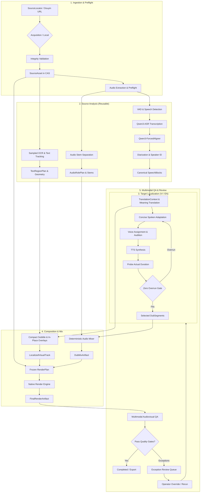

# Douyinie Phase 1 — Canonical Architecture Specification

> **Status:** Canonical & Locked<br>
> **Source Authority:** [Closed Issue #16 Resolution](https://github.com/monet88/douyinie/issues/16) (Final Architecture Lock) reconciled with [Implementation Spec #18](https://github.com/monet88/douyinie/issues/18) and normative revalidation amendments (including issues #19, #20, #21, and the 5-video E2E acceptance benchmark suite).<br>
> **Document Purpose:** Authoritative architectural specification for Douyinie Phase 1. It governs system boundaries, data contracts, stage orchestration, visual and audio processing pipelines, runtime supervision, security/licensing rules, operator review mechanics, canonical acceptance fixtures, and testing seams.

---

## 1. Executive Summary & Core Architectural Principles

Douyinie is an automated, policy-gated video localization platform that transforms Chinese short-form videos (Douyin) into natural, timeline-constrained localized versions in **Vietnamese and English (VI/EN)**.

The system is architected around seven non-negotiable principles:

1. **Quality-First & Meaning-First**: Localization preserves the semantic essence, emotional tone, and instructional clarity of the original content. Translation prioritizes concise, natural spoken phrasing rather than literal translation.
2. **Local-First & Artifact-First**: All metadata, run states, and media artifacts live locally. Model stages emit immutable, content-addressed artifacts to a Content-Addressed Store (CAS) indexed by SQLite.
3. **Immutable Source-Timing Anchors**: The visual cuts and source timeline of the original video are strictly immutable. Video frames are never stretched, slowed, or retimed. Spoken adaptation must fit within the immutable source speech windows, enforcing zero adjacent-speech overrun (`tts_finish <= source_end`) and preserving natural breathing room.
4. **Dialogue & Narration Dubbing Only (Perceptual Soundtrack Preservation)**: Only spoken speech requiring translation is dubbed. Background music (BGM), sound effects (Foley, ambient, UI/touch SFX), singing/music-vocals, and instrumental showcases/outros are preserved perceptually and semantically outside and through dialogue replacement as separation/mix permits. Full-track TTS replacement is prohibited. Bitstream-exact audio preservation is expected only on true passthrough branches where audio passes through completely unmodified.
5. **Multi-Role Visual Text Localization (`TextRegionPlan`)**: Visual text is classified into discrete operational roles (`speech_subtitle`, `semantic_text`, `instructional_ui_text`, `brand_keep`, `ignore/noise`). Meaningful Chinese text is covered and localized in-place by default using deterministic overlay; subtitle backgrounds hug rendered text tightly (compact fit-content presentation with scale-aware padding guidance) without obscuring active UI controls, timeline tracks, or tap targets.
6. **Provider-Neutral & Policy-Governed**: Local, hybrid, and cloud providers share identical domain contracts. Provider selection enforces policy and licensing constraints strictly before considering runtime health or cost.
7. **Automation-First with Exception-Only Review**: The pipeline executes unattended by default. Passing and auto-resolved segments bypass human intervention; the review queue surfaces only genuine confidence, timing, cover, or policy exceptions.

### 1.1 Production Translation Routing Amendment

Provider neutrality remains an interface property, but production eligibility is intentionally narrower than the set of adapters present in the repository:

- VI/EN meaning translation for both speech and translatable visual text uses the authorized gateway in order `gemini-3.8-flash` -> `deepseek-v4.1-flash`.
- Local general-purpose LLM translation is not production-eligible and is not a fallback after remote failure. If both remote lanes fail policy, authorization, availability, or meaning-first QA, the translation stage fails closed and may surface review.
- `ExecutionProfileLocal` is not an end-to-end localization release path. It verifies specialized local media stages without requiring a local translation LLM.
- Constrained local GPU/CPU resources are reserved for ASR/alignment/diarization, TTS, separation, OCR/tracking, mixing, and rendering. Local OCR remains the source text detector; its translatable text is passed through the remote translation provider contract.

Historical research and benchmark records that evaluated local Qwen translation remain evidence of prior decisions/runs, not the current production route.

---

## 2. System Boundaries & Execution Topology

The Douyinie architecture strictly bifurcates the **Control Plane** and the **Execution Plane** across well-defined process boundaries.

```
┌─────────────────────────────────────────────────────────────────────────────┐
│                              CONTROL PLANE                                  │
│                                                                             │
│  ┌───────────────────────────────────────────────────────────────────────┐  │
│  │                     Browser-on-Localhost Web UI                       │  │
│  │      (Exception Review Queue, Region Inspector, Voice Audition)       │  │
│  └───────────────────────────────────┬───────────────────────────────────┘  │
│                                      │ HTTP / WebSocket                     │
│  ┌───────────────────────────────────▼───────────────────────────────────┐  │
│  │                    RuntimeHost (Localhost API Daemon)                 │  │
│  │                                                                       │  │
│  │   ┌────────────────────────┐  ┌───────────────────────────────────┐   │  │
│  │   │  Pipeline Orchestrator │  │   ProviderRegistry / Router       │   │  │
│  │   │  (Stage FSM, DAG Calc) │  │   (Policy, Capability, Health)    │   │  │
│  │   └───────────┬────────────┘  └───────────────────────────────────┘   │  │
│  │               │                                                       │  │
│  │   ┌───────────▼────────────┐  ┌───────────────────────────────────┐   │  │
│  │   │   WorkerSupervisor     │  │   ResourceScheduler               │   │  │
│  │   │   (Process Tree/IPC)   │  │   (Single GPU Lease, Family Switch) │  │
│  │   └───────────┬────────────┘  └───────────────────────────────────┘   │  │
│  │               │                                                       │  │
│  │   ┌───────────▼────────────┐  ┌───────────────────────────────────┐   │  │
│  │   │ SQLite Metadata Store  │  │ Content-Addressed Store (CAS)     │   │  │
│  │   │ (Runs, Jobs, Review)   │  │ (Immutable Artifacts & Manifests) │   │  │
│  │   └────────────────────────┘  └───────────────────────────────────┘   │  │
│  └───────────────────────────────────┬───────────────────────────────────┘  │
└──────────────────────────────────────┼──────────────────────────────────────┘
                                       │ NDJSON over stdin/stdout
┌──────────────────────────────────────┼──────────────────────────────────────┐
│                                      │ (Artifact Path Refs Only)            │
│                              EXECUTION PLANE                                │
│                                                                             │
│   ┌────────────────────────┐ ┌────────────────────────┐ ┌────────────────┐  │
│   │   StageWorker: ASR     │ │ StageWorker: AudioSep  │ │ StageWorker:   │  │
│   │   (Qwen3-ASR / Aligner)│ │ (python-audio-separator│ │ OCR & Overlay  │  │
│   │                        │ │  UVR / Demucs fallback)│ │ (Inpaint fallb)│  │
│   └────────────────────────┘ └────────────────────────┘ └────────────────┘  │
│   ┌────────────────────────┐ ┌────────────────────────┐ ┌────────────────┐  │
│   │   StageWorker: TTS     │ │ StageWorker: Renderer  │ │ Cloud Adapter  │  │
│   │ (ZeroTTS/VieNeu/Cosy)  │ │ (FFmpeg / Native Mix)  │ │ (LLM/Cloud TTS)│  │
│   └────────────────────────┘ └────────────────────────┘ └────────────────┘  │
└─────────────────────────────────────────────────────────────────────────────┘
```

### 2.1 Control Plane: `RuntimeHost`
- **Role**: The single authoritative coordinator process managing the local HTTP/WebSocket API, Job/Run lifecycle, SQLite metadata, resource scheduling, StageWorker process trees, and review projections.
- **API-First Design**: The frontend UI interacts purely via versioned REST/WebSocket endpoints. The UI never interacts directly with underlying ML models or file paths.
- **Single Writer Principle**: `RuntimeHost` is the sole writer to the SQLite database. Workers report completion, progress, and metric envelopes back via IPC; they never write directly to SQLite.

### 2.2 Storage Layer: SQLite & Filesystem CAS
- **Authoritative State (SQLite)**: Stores relational entity metadata, job configurations, provider attempt logs, selection decisions, review items, and artifact manifests.
- **Content-Addressed Store (CAS)**:
  - Stores all media files, intermediate model outputs, and serialized JSON plans under content-derived SHA-256 hashes (`/cas/ab/cd/<sha256>`).
  - Writes utilize same-volume temporary staging followed by atomic renames to avoid partial reads. No symlinks are used (Windows compatibility invariant).
  - Garbage collection is reachability-based with explicit pins for active runs and a configurable retention grace period.

### 2.3 Execution Plane: Isolated `StageWorkers`
- **Process Isolation**: ML frameworks (PyTorch, ONNX Runtime, CUDA) and heavy tools (FFmpeg) run in dedicated worker subprocesses organized into **Worker Families** (e.g., `family_asr`, `family_tts`, `family_separator`, `family_render`).
- **IPC Protocol**: Workers communicate with the `RuntimeHost` via a versioned, metadata-only NDJSON protocol over standard input/output (`stdin`/`stdout`). Large media payloads are passed strictly via filesystem CAS artifact references.
- **Single GPU Resource Lease**: Phase 1 targets single-GPU environments (8 GB VRAM baseline). The `ResourceScheduler` issues a single active GPU lease at any time. When switching worker families, the active lease is released and the previous worker process may be terminated to ensure complete, deterministic VRAM reclamation.
- **Windows Process Tree Supervision**: `WorkerSupervisor` attaches all worker subprocesses to Windows Job Objects (or equivalent process tree tracking), guaranteeing that on cancellation, timeout, or crash, all descendant processes (e.g. FFmpeg, Python, CUDA kernels) are forcefully terminated without orphan leaks.

---

## 3. Canonical Domain Model & Data Contracts

The domain model enforces immutable time coordinates, strict artifact provenance, and distinct separation between source truth and target adaptations.

```
SourceAsset (Immutable Media + SHA256)
  │
  ├──► AudioRolePlan (Dialogue vs. Singing vs. SFX vs. BGM)
  ├──► TextRegionPlan (Subtitles, Semantic Labels, UI Text, Brand Keep)
  ├──► TranscriptArtifact (SpeechBlocks, Tokens, Diarization, Timing)
  └──► AudioStemArtifacts (Isolated Vocals, Background Music, Ambience)
         │
         ▼ (Crossed with Target Language VI / EN)
LocalizationJob (SourceAsset × target_language)
  │
  ├──► TranslationVariant (Meaning-Preserving Target Text)
  ├──► DubScriptVariant (Concise, Duration-Adapted Phrasing)
  ├──► VoiceAssignment (Frozen per-speaker VoiceProfile mapping)
  ├──► DubSegments (Synthesized Audio + Measured Duration Verification)
  ├──► DubMixArtifact (Localized Speech + Preserved Background Stems)
  ├──► LocalizedVisualTrack (Compact Subtitles + In-Place Text Overlays)
  └──► RenderPlan ──► FinalRenderArtifact + Multimodal QualityResult
```

### 3.1 Core Domain Entities

1. **`SourceLocator`**: The input handle (Douyin share URL, web URL, or local file path) with optional acquisition metadata. It is not a durable media identity.
2. **`SourceAsset`**: The canonical, normalized source media file stored in CAS, validated for container integrity and fingerprint consistency, paired with source rights attestation.
3. **`SourceTimeline`**: The immutable temporal coordinate system defined by `SourceAsset` (frame rate, audio sample rate, total duration, visual cut timestamps). All downstream operations anchor strictly to `SourceTimeline`.
4. **`LocalizationJob`**: The logical localization task defined as `SourceAsset × target_language` (where target is `vi` or `en`). Source-derived extraction artifacts are computed once and reused across jobs for different target languages.
5. **`LocalizationRun`**: An execution attempt of a `LocalizationJob` bound to an immutable `RunConfigSnapshot` (freezing routing policies, model presets, and thresholds). Secrets are strictly excluded from snapshots.
6. **`SpeechBlock`**: The atomic speech unit derived after forced alignment and diarization. It defines an immutable source timing window: `[start_ms, end_ms, speaker_id, source_text, token_timings]`.

### 3.2 Operational Plans & Artifact Contracts

- **`AudioRolePlan`**: Temporal classification of source audio channels into:
  - `narration/dialogue`: Spoken speech requiring translation and dubbing.
  - `singing/music-vocal`: Sung lyrics or musical vocals; retained in the background stem; never routed to the dubbing engine.
  - `instrumental/background`: BGM and musical showcases; 0% TTS injection.
  - `ambience/SFX`: Environmental and Foley sounds (frying pans, knife cuts, water drops, UI taps); preserved throughout.
  - *Policy & Routing Invariant:* Uncertain role classification flags `REVIEW_REQUIRED`, never automatic replacement. A video with no dub-eligible speech bypasses the dubbing branch but continues through visual localization and final render.
- **`TextRegionPlan`**: Spatial and temporal tracking plan for on-screen Chinese text:
  - `speech_subtitle`: Dialogue subtitles replaced by compact fit-content overlays.
  - `semantic_text`: Content-critical text (recipe steps, ingredients, floating badges) covered and localized in-place.
  - `instructional_ui_text`: Application UI labels and menus (e.g. CapCut/JianYing buttons) covered and localized in-place using standard target terminology.
  - `brand_keep`: Trademarks, logos, product brand names preserved unchanged.
  - `ignore/noise`: Watermarks, decorative artifacts, compression noise ignored.
  - *Layout Guidance:* Padding and line limits are scale-aware reference targets (~18–28px horizontal, ~10–16px vertical for 1080x1920 video; 1–2 lines max) rather than rigid universal constants.
- **`VoiceAssignment`**: A frozen, run-scoped mapping of `speaker_id -> VoiceProfile` (specifying provider, voice ID, gender, pitch, and timbre). Engine hopping across sentences for a single speaker is strictly prohibited. Includes an optional `Use same voice for all` convenience control for multi-speaker setups.
- **`DubbingFitPlan`**: Per-segment cadence adaptation calculating target word budget, TTS duration probing, speed-fit adjustments, and natural pause margins.
- **`SoundtrackPreservationPlan`**: Defines the mixing strategy across the timeline: dialogue-only suppression within active speech windows and passthrough of the background stem across the entire timeline. Operates perceptually/semantically as separation/mix permits; bitstream-exact audio is expected only on true passthrough branches.
- **`RenderPlan`**: Complete, deterministic composition recipe freezing exact CAS artifact references for video streams, overlays, and audio mix tracks.

### 3.3 Provenance & Targeted Invalidation DAG

Every provider invocation produces an immutable `ProviderAttempt`. Selections are recorded via append-only `SelectionDecision` records. When an operator modifies a text string, bounding box, or voice setting, only its downstream descendants in the Directed Acyclic Graph (DAG) are invalidated:

```
[Target Text Edit] ────────► [TTSAttempt] ──► [DubSegment] ──► [DubMix] ────────┐
                                                                                 ▼
[Voice Assignment Edit] ───► [TTSAttempt] ──► [DubSegment] ──► [DubMix] ──► [RenderPlan] ──► [Final Render]
                                                                                 ▲
[Text Region/Box Edit] ────► [TextRegionPlan] ────────► [LocalizedVisualTrack] ──┘
```
*Source video extraction, vocal separation stems, ASR transcripts, and forced alignment remain completely intact and cached.*

---

## 4. End-to-End Processing Pipeline & Stage Graph



### Stage Details

1. **Acquisition & Preflight**: Probes source URL, validates Douyin policy constraints (structural auth checks without captcha bypass), downloads or ingests local media, computes SHA-256, extracts normalized 16kHz WAV audio, and creates `SourceAsset`.
2. **Speech Understanding**: Runs VAD, transcribes Chinese speech via `Qwen3-ASR` (1.7B quality attempt / 0.6B fallback), aligns phonemes/words via `Qwen3-ForcedAligner`, assigns speakers, and produces canonical `SpeechBlock` boundaries.
3. **Audio Separation & Stem Generation**: Isolates source vocals and background audio via high-fidelity separation models (`python-audio-separator` / UVR-family baseline, Demucs-family fallback), classifies music vs. dialogue via `AudioRolePlan`, and generates background stems.
4. **Visual Text Tracking**: Detects and tracks on-screen Chinese text across video frames, classifying regions into `speech_subtitle`, `semantic_text`, `instructional_ui_text`, `brand_keep`, or `ignore`.
5. **Translation & Spoken Adaptation**: Translates source text into Vietnamese/English with cultural fidelity; applies **shorten-first** adaptation to compress syllable count for brisk source segments.
6. **TTS Synthesis & Duration Fitting**: Synthesizes speech using assigned voice profiles, probes true waveform duration, applies calibrated speed-fit if necessary, enforces zero adjacent overrun (`tts_finish <= source_end`), and preserves inter-sentence breathing pauses.
7. **Audio Mixing**: Suppresses source dialogue within active speech windows while preserving background stems (BGM, SFX, ambience) and overlays the localized dub track to produce `DubMixArtifact`.
8. **Visual Composition**: Renders compact fit-content subtitle boxes hugging target dialogue text and generates in-place localized cover overlays for semantic and UI text regions.
9. **Native Video Rendering**: Assembles the localized visual layers and mixed audio track via FFmpeg into the final MP4 artifact.
10. **Multimodal Quality Inspection & Review**: Performs automated audiovisual QA (checking naturalness, soundtrack preservation, text elimination, and synchronization); clean results complete automatically; exceptions are queued for human review.

---

## 5. Multi-Role Visual Text & Compact Subtitle Architecture

Visual text localization in Douyinie Phase 1 is governed by the **`TextRegionPlan`** and the normative **Compact Fit-Content Presentation Standard (V3)** established through empirical acceptance testing.

```
┌─────────────────────────────────────────────────────────────────────────────┐
│                       FULL VIDEO FRAME (1080 x 1920)                        │
│                                                                             │
│   ┌─────────────────────────────────────────────────────────────────────┐   │
│   │ [semantic_text] In-Place Cover: "Bước 1: Chuẩn bị trà Matcha"       │   │
│   └─────────────────────────────────────────────────────────────────────┘   │
│                                                                             │
│                                (Video Action)                               │
│                                                                             │
│                       ┌───────────────────────────────┐                     │
│                       │   [instructional_ui_text]     │                     │
│                       │   In-Place: "Lớp phủ" (Cover) │                     │
│                       └───────────────────────────────┘                     │
│                                                                             │
│                                                                             │
│            ┌───────────────────────────────────────────────────┐            │
│            │ [speech_subtitle] V3 Compact Fit-Content Box:     │            │
│            │ "Hãy cắt tỉa gốc hoa xéo 45 độ nhé"               │            │
│            │ (Hugs text: 1-2 lines, scale-aware padding)       │            │
│            └───────────────────────────────────────────────────┘            │
│                                                                             │
│   [brand_keep] "SUPOR" (Original preserved)                                 │
│                                                                             │
│   ┌─────────────────────────────────────────────────────────────────────┐   │
│   │ [Protected Area] CapCut Timeline Track & Playhead (Never Obscured) │   │
│   └─────────────────────────────────────────────────────────────────────┘   │
└─────────────────────────────────────────────────────────────────────────────┘
```

### 5.1 First-Class Text Roles (`TextRegionPlan`)

1. **`speech_subtitle`**: Spoken dialogue and narration subtitles. Replaced using the V3 compact fit-content subtitle box.
2. **`semantic_text`**: Content-critical visual text (recipe steps, ingredient callouts, bullet points, floating titles). Localized in-place using solid background cover boxes matching source aesthetics.
3. **`instructional_ui_text`**: Software interface buttons, menus, and controls demonstrated in tutorials (e.g. CapCut/JianYing buttons: `Xuất`, `Lớp phủ`, `Keyframe`, `Độ mờ`). Covered and localized in-place using standard target terminology.
4. **`brand_keep`**: Manufacturer logos, product packaging marks, and verified prop brands. Preserved unchanged to maintain visual authenticity.
5. **`ignore/noise`**: Platform watermarks, compression artifacts, decorative glyphs, and non-content noise. Skipped without processing.

### 5.2 Deterministic In-Place Cover (Default) vs. Inpainting (Fallback)
- **Deterministic In-Place Cover (Default)**: Visual text is covered by a localized bounding box with background color sampled from adjacent video regions, with high-contrast localized typography rendered on top. This avoids heavy, hallucination-prone video inpainting on the common execution path.
- **Inpainting (Non-Default Fallback)**: Reserved exclusively for rare exceptions where text directly overlays complex moving textures or human faces and solid cover is visually unacceptable. ProPainter is excluded from automatic commercial fallback routing unless its licensing status and dependencies are separately authorized.

### 5.3 V3 Compact Fit-Content Subtitle Presentation Standard
Superseding older full-width rectangular banner designs:
- **Geometry**: The background box hugs the rendered text tightly in width and height (fit-content).
- **Line Count Guidance**: 1–2 lines maximum recommended for readability. Long sentences are wrapped or adapted concisely.
- **Padding Guidance**: Scale-aware reference targets (~18–28px horizontal, ~10–16px vertical for 1080x1920 video) serving as tunable layout guidance rather than rigid universal hard constants.
- **Scene-Aware Non-Occlusion**: Subtitles and in-place overlays must never obscure active tutorial controls, timeline tracks, sliders, finger tap targets, or faces. Minor edge peeking of source Chinese glyphs is acceptable when necessary to prevent occluding interactive UI elements.

---

## 6. Audio Dubbing, Pacing & Soundtrack Preservation Architecture

### 6.1 `AudioRolePlan` & Branch Routing

```
                          Source Audio Track
                                  │
                  ┌───────────────┴───────────────┐
                  ▼                               ▼
         Speech / Vocal Stem              Background Stem (BGM/SFX)
                  │                               │
        ┌─────────┴─────────┐                     │
        ▼                   ▼                     │
[narration/dialogue]  [singing/music-vocal]       │
        │                   │                     │
        ▼ (Dub Branch)      ▼ (Bypass Dubbing)    │
Concise Translation     Preserved Untouched       │
        │                   │                     │
TTS + Duration Fit          │                     │
        │                   │                     │
        ▼                   ▼                     ▼
Localized Speech Bus  Original Singing Bus  Preserved BG Bus
        │                   │                     │
        └───────────────────┼─────────────────────┘
                            ▼
                  Deterministic Audio Mixer
                            │
                            ▼
                     DubMixArtifact
```

1. **`narration/dialogue`**: Spoken Chinese dialogue entering the translation and TTS dubbing branch.
2. **`singing/music-vocal`**: Musical vocals or singing identified during ASR/VAD. ASR-positive singing is classified as triage and **bypasses the dubbing branch**, remaining preserved in the background mix.
3. **`instrumental/background`**: Pure music, showcase sections, and video outros. 0% TTS injection.
4. **`ambience/SFX`**: Environmental Foley effects (cutting, sizzling, pouring, cartoon SFX) preserved outside and through dialogue windows.

*Operational Rules:*
- **Uncertain Classification**: Uncertain audio role classification is flagged as `REVIEW_REQUIRED` in the operator review queue rather than executing automatic replacement.
- **No-Dub Execution**: Videos with no dub-eligible speech skip the dubbing branch entirely but proceed through visual text localization, overlay composition, and final video rendering.
- **Soundtrack Preservation**: Operates perceptually and semantically—preserving BGM, Foley, and ambience as separation/mix permits. Bitstream-exact audio is expected only on true passthrough branches.

### 6.2 Immutable Source-Timing & Zero-Overrun Guarantee
- **Immutable Source Window**: For every speech block $i$, start time $S_i$ and end time $E_i$ are permanently locked to the source video.
- **Zero Overrun Invariant**: The synthesized localized audio duration $D_i$ must strictly satisfy:
  $$\text{tts\_finish}_i = S_i + D_i \le E_i$$
- **Natural Breathing Room**: Adjacent speech segments must maintain perceptible inter-turn silence ($\Delta_{\text{pause}} = S_{i+1} - (S_i + D_i) \ge \text{threshold}$) to prevent unnatural run-on speech.
- **Shorten-First Principle**: When source speech is rapid, translation must rewrite concise phrasing first rather than forcing extreme audio speed-up.
- **Fixture Evidence vs. Universal Contracts**: Specific measurements observed in test fixtures (such as Video 4's ~74% occupancy and >0.5s pause gap) represent empirical fixture evidence, not universal hard-coded thresholds. The universal invariants remain measured media truth, `tts_finish <= source_end`, no adjacent speech collision/run-on, preserving perceptible turn gaps, and passing source-relative cadence AV QC.

### 6.3 Pre-Dub Voice Audition & Selection
Before initiating a full video dub render, operators have direct pre-dub audition capabilities:
- **AI Recommended Default**: System assigns an optimal voice per speaker automatically based on detected gender, pitch, and energy. Vietnamese runs default to the ZeroTTS unattended rotation (`quangminh`, then `maichi`); English runs keep the Kokoro rotation.
- **Standalone Audition (~5s)**: Immediate preview of the voice profile speaking a short sample phrase or playing a representative voice preset sample.
- **Contextual Audition (~10s)**: High-fidelity preview synthesizing an actual translated segment from the current video mixed in real-time with the separated background BGM/SFX.
- **Stable Per-Speaker Assignment**: One voice profile is assigned per speaker for the entire video run. Sentence-by-sentence engine hopping is prohibited.
- **`Use same voice for all` Convenience**: Optional UI convenience control to rapidly apply a single selected voice profile across all detected speakers.
- **No-Speech Bypass**: Videos with 0 spoken dialogue lines display `No dubbing required` and bypass voice audition.

### 6.4 TTS Provider Routing
- **Vietnamese (VI) Default**: `ZeroTTS` (CPU-only, offline, packaged preset voices) using the approved unattended rotation `quangminh` first, then `maichi`. The remaining verified packaged presets stay selectable through explicit operator audition/assignment; catalog presence alone never makes a preset an unattended default.
- **VI Compatibility Lane**: `VieNeu-TTS` remains routable for historical frozen `VoiceAssignment`s and preserves their original provider/voice identity; it is no longer the unattended default and no historical assignment is rewritten in place.
- **VI High-Quality / Duration-Controlled Fallback**: `CosyVoice3` operating under a calibrated multi-pass lane:
  $$\text{Natural Pass} \longrightarrow \text{Probe Duration} \longrightarrow \text{Measured Speed-Fit} \longrightarrow \text{Re-Probe} \longrightarrow \text{AV Quality Gate}$$
  It remains conditional and outside the unattended default rotation. The ZeroTTS preset lane declares a fixed speaking rate: a non-1.0 speed request fails closed, so overrun remediation on that lane is rewrite/regroup/review rather than speed resynthesis.
- **Whole-Speaker Escalation to the Fallback Lane**: When the bounded rewrite/regroup remedies leave a speaker's immutable source slot overrun on a fixed-rate lane (ZeroTTS) and CosyVoice3 is policy/license/runtime eligible, the run creates a superseding **speaker-scoped** `VoiceAssignment` and regenerates that speaker's TTS/DubSegment/DubMix/render descendants on the fallback lane. The provider change is never sentence-scoped: no output mixes engines within one speaker under a frozen assignment. Unaffected speakers keep their reusable artifacts and resolution, and a speaker whose escalated regeneration still fails timing/quality projects `REVIEW_REQUIRED` instead of hopping providers again.
- **English (EN) Baseline**: `Kokoro` (lightweight, non-cloning) and `Chatterbox` (lower-VRAM clone fallback).
- **Measured-Duration Authority**: Selection and acceptance for every lane use the probed actual synthesized WAV duration, never a predicted duration; an overrunning candidate cannot enter the selected/final mixed set.
- **Policy Enforcement & Exclusions**: Provider license and privacy eligibility strictly outrank synthesis quality. `IndexTTS2` is explicitly excluded from routing for unauthorized source-reference cloning.

---

## 7. Runtime Packaging, Worker Supervision & Resource Scheduling

```
┌─────────────────────────────────────────────────────────────────────────────┐
│                     RuntimeHost (ResourceScheduler)                         │
│                                                                             │
│   Active Lease: [ GPU Lease: NVIDIA RTX (8GB VRAM) ] ── Allocated to: ASR   │
└──────────────────────────────────────┬──────────────────────────────────────┘
                                       │ Lease Switch: Teardown ASR Worker
┌──────────────────────────────────────▼──────────────────────────────────────┐
│   WorkerSupervisor (Windows Job Objects / Complete Process Tree Tracking)   │
│                                                                             │
│   ┌─────────────────────────────────────────────────────────────────────┐   │
│   │ [Terminated] StageWorker: family_asr (PID 10420)                     │   │
│   │   └── Descendant PyTorch / CUDA Contexts Freed & VRAM Reclaimed     │   │
│   └──────────────────────────────────┬──────────────────────────────────┘   │
│                                      │ Spawn with Fresh VRAM
│   ┌──────────────────────────────────▼──────────────────────────────────┐   │
│   │ [Active] StageWorker: family_tts (PID 11840)                        │   │
│   │   ├── NDJSON Protocol (stdin/stdout)                                │   │
│   │   └── GPU Lease: VieNeu / CosyVoice3 (ZeroTTS is CPU-only)          │   │
│   └─────────────────────────────────────────────────────────────────────┘   │
└─────────────────────────────────────────────────────────────────────────────┘
```

### 7.1 Single-GPU Lease & Deterministic VRAM Reclamation
- **Target Environment**: Standard developer and workstation hardware with a single 8 GB VRAM GPU.
- **Single Active Lease**: The `ResourceScheduler` grants only one GPU lease across the entire application at any given time.
- **Worker Family Transitions**: Switching from an ASR stage (`family_asr`) to a TTS stage (`family_tts`) or separation stage (`family_separator` using `python-audio-separator` / UVR / Demucs) requires releasing the lease and terminating the worker process. This guarantees that PyTorch/CUDA runtime caches are fully released back to the OS and eliminates out-of-memory (OOM) accumulation.

### 7.2 Windows Process Tree Supervision
- `WorkerSupervisor` wraps all spawned worker processes inside Windows Job Objects configured with `JOB_OBJECT_LIMIT_KILL_ON_JOB_CLOSE`.
- On user cancellation, pipeline timeout, or worker failure, the Job Object terminates the entire process tree simultaneously, guaranteeing that external FFmpeg binaries, Python child processes, or CUDA worker threads never leak into orphaned background states.

### 7.3 Versioned Worker Environments (CapCap Pattern Elimination)
- Heavy ML dependencies and model weights are packaged as **immutable, versioned WorkerFamily environments** with cryptographic manifests.
- Douyinie strictly prohibits runtime DLL injection, dynamic monkey-patching, or in-place modification of `site-packages` at execution time. Upgrading a model or library creates a new discrete environment version.
- ProPainter is excluded from automatic commercial fallback environments unless separately authorized.

---

## 8. Security, Licensing & Configuration Governance

```
┌─────────────────────────────────────────────────────────────────────────────┐
│                      FOUR INDEPENDENT OBLIGATION LAYERS                     │
├──────────────────────┬──────────────────────┬───────────────────────────────┤
│ 1. CODE_LICENSE      │ MIT / Apache-2.0     │ Open-source pipeline logic    │
├──────────────────────┼──────────────────────┼───────────────────────────────┤
│ 2. MODEL_LICENSE     │ Weights & Checkpoints│ Non-commercial / Commercial   │
├──────────────────────┼──────────────────────┼───────────────────────────────┤
│ 3. DATA_LICENSE      │ Dataset Provenance   │ Training data rights & terms  │
├──────────────────────┼──────────────────────┼───────────────────────────────┤
│ 4. SERVICE_TERMS     │ API Terms of Service │ Privacy, rate limits, storage │
└──────────────────────┴──────────────────────┴───────────────────────────────┘
```

### 8.1 Fail-Closed Licensing Governance
- **`LicenseManifestEntry`**: Every auto-downloaded model weight, checkpoint, or external dependency is guarded behind an immutable, versioned manifest declaring its exact content SHA-256, source repository, and license category.
- **Fail-Closed Execution**: If an unverified checkpoint or missing license manifest is detected, the runtime refuses execution.
- **Four Independent Obligation Layers**: Rewriting source code (`CODE_LICENSE`) does not alter obligations attached to underlying model weights (`MODEL_LICENSE`), training data (`DATA_LICENSE`), or third-party APIs (`SERVICE_TERMS`).

### 8.2 Provider Policy States & Policy-Before-Health Routing
Every provider in the `ProviderRegistry` possesses a strict policy state:
- `ALLOWED`: Approved for automated unattended execution.
- `REQUIRES_EXPLICIT_CONSENT`: Requires operator consent prior to invocation (e.g. third-party cloud data transmission).
- `REQUIRES_AUTHORIZATION`: Requires explicit enterprise or API credentials.
- `BLOCKED`: Prohibited by license, privacy policy, or regional restrictions (e.g. `IndexTTS2` unauthorized cloning).

**Policy-Before-Health Invariant**: A provider with `BLOCKED` or unauthorized policy status can never be selected by fallback routing, regardless of its runtime health, speed, or zero-cost status.

### 8.3 Credentials & Privacy Protection
- API keys, session tokens, and Douyin login cookies are stored exclusively in local OS secure credential storage.
- SQLite run logs, CAS manifests, and export bundles hold safe credential references only; raw secrets are never persisted in artifacts or exported manifests.
- Telemetry export is disabled by default.

### 8.4 Douyin Ingestion Policy
- Acquisition operations surface structured auth states (`AUTH_REQUIRED`, `SESSION_EXPIRED`, `CAPTCHA_REQUIRED`, `ANTI_BOT_OR_EMPTY_RESPONSE`, `CONTENT_UNAVAILABLE`, `DOWNLOAD_FAILED`, `INTEGRITY_FAILED`).
- The system includes **zero anti-bot, captcha-bypass, or scraping exploits**. When Douyin access requires authentication, the system prompts the operator for authorized local credentials or falls back to direct local file upload.

---

## 9. Operator Review & Exception Queue Architecture

Douyinie Phase 1 implements **Variant A: Queue + Inspector** as its canonical operator review interface.

```
┌─────────────────────────────────────────────────────────────────────────────┐
│                      DOUYINIE OPERATOR REVIEW QUEUE                         │
├─────────────────────────────────────────────────────────────────────────────┤
│ Queue: 2 Actionable Exceptions                     [Auto Mode: PAUSED]      │
│                                                                             │
│ ┌───────────────────────┐ ┌───────────────────────────────────────────────┐ │
│ │ Seg #3: Overrun Risk  │ │ Inspector: Speech Segment #3 (12.4s - 14.1s)   │ │
│ │ (1.9s text in 1.7s)   │ │ Source: "点击右上角导出视频"                    │ │
│ ├───────────────────────┤ │ Target: "Nhấn vào góc trên bên phải để xuất"   │ │
│ │ Seg #7: UI Occlusion  │ │                                                │ │
│ │ (Cover hits button)   │ │ Spoken Adaptation Override:                    │ │
│ └───────────────────────┘ │ [ "Nhấn góc trên phải để xuất video" ]        │ │
│                           │                                                │ │
│                           │ [ Audition Segment (10s) ]  [ Accept & Rerun ] │ │
│                           └────────────────────────────────────────────────┘ │
└─────────────────────────────────────────────────────────────────────────────┘
```

### 9.1 Exception-Only Review Routing
- **Unattended Path**: Videos where all segments pass confidence, timing fit, subtitle layout, and safety gates complete automatically.
- **Actionable Exceptions**: The review queue surfaces only segments requiring human intervention:
  - Tight timing or duration overrun ($D_{\text{tts}} > T_{\text{source}}$).
  - Ambiguous visual text role classification or low OCR confidence.
  - Subtitle bounding box colliding with active UI buttons or tap targets.
  - Pronunciation or acoustic anomaly flagged by multimodal QA.
  - Meaning-gate violations on a translated or spoken segment (facts, numbers, entity names, negation polarity) when no provider lane produced a clean candidate: the best candidate is persisted with the offending segment flagged, and the run continues.

### 9.2 Approval States & Semantics
- `auto_pass`: Stage passed all automated quality gates without human input.
- `auto_resolved`: An automated rerun or parameter adjustment produced a passing candidate; item leaves the queue automatically.
- `manual_override`: The operator explicitly accepts or overrides a flagged item with an auditable decision record.

### 9.3 Direct-Manipulation Controls
- **Visual Inspector**: Operators can adjust, resize, drag, or reclassify bounding boxes for `TextRegionPlan` elements in the video canvas.
- **Script Inspector**: Operators can directly edit target translation text or phoneme annotations.
- **Voice Inspector**: Operators can audition and reassign voices per speaker (with `Use same voice for all` support).
- **Handoff Modes**:
  - *Auto Mode*: Pipeline resumes final rendering immediately when the exception queue reaches zero.
  - *Review Mode*: Pipeline pauses at queue zero, requiring explicit operator confirmation to begin final rendering.

---

## 10. Approved Testing Seams & Architectural Invariants

Phase 1 maintains **exactly two approved architectural integration/acceptance testing seams** (Seam 1 and Seam 2) for pipeline orchestration and worker contracts. This policy governs architectural boundary verification and prevents spurious intermediate service-level seams (e.g. separate standalone AudioMix or Render service seams); it does not prohibit developers from writing standard, fast in-memory unit tests for pure internal functions, parsers, or math helpers.

```
┌─────────────────────────────────────────────────────────────────────────────┐
│                           APPROVED TESTING SEAMS                            │
├─────────────────────────────────────────────────────────────────────────────┤
│                                                                             │
│  SEAM 1: Localhost RuntimeHost API Contract (Primary Acceptance Seam)       │
│  - Drives real Orchestrator + SQLite + CAS + Scheduler end-to-end           │
│  - Controlled synthetic media + deterministic fake/stub ProviderRegistry    │
│  - Verifies zero-overrun, targeted invalidation, retry provenance, crash    │
│    recovery, mixer purity, exception queue handoff, and audio role routing   │
│                                                                             │
│  SEAM 2: StageWorker Runtime Contract (Process & Protocol Seam)             │
│  - Tests RuntimeHost ↔ StageWorker NDJSON protocol serialization            │
│  - Verifies structured error envelopes, heartbeat timeouts, cancel signals  │
│  - Verifies Windows Job Object process-tree cleanup (no orphan FFmpeg/CUDA) │
│  - Verifies single GPU lease acquire/release & deterministic VRAM teardown  │
│                                                                             │
└─────────────────────────────────────────────────────────────────────────────┘
```

### 10.1 Seam 1: RuntimeHost Localhost API Contract
Acceptance tests exercise the complete pipeline via public HTTP/WebSocket endpoints using synthetic media fixtures and deterministic mock providers.

**Mandatory Invariant Verification Suites:**
1. **TTS Overflow Gate**: A synthesized audio candidate longer than its immutable source slot is rejected and cannot reach the final audio mixer without adaptation or review override.
2. **No Adjacent Speech Collision**: Selected `DubSegment`s never overlap adjacent speech windows due to prior clip overrun.
3. **No Cumulative Anchor Drift**: Overrun pressure on earlier segments never shifts the timing anchors of subsequent segments across the timeline.
4. **ASR Boundary Independence**: Long, multi-sentence VAD turns are split into canonical `SpeechBlock` units via forced alignment and punctuation rules, never blindly copying raw ASR boundaries.
5. **Targeted Invalidation**: Modifying target text, region geometry, or voice settings invalidates only declared downstream DAG descendants; source extraction artifacts are reused.
6. **Retry Provenance**: Retried provider attempts remain visible in history; `SelectionDecision` records are append-only.
7. **Crash & Resume**: Committed CAS artifacts and SQLite records survive unexpected daemon crashes; partial files are discarded and lost attempts transition to `INTERRUPTED`.
8. **Policy-Before-Health**: A healthy provider in `BLOCKED` or unauthorized policy status is never selected by automated fallback routing.
9. **Preview/Final Parity**: Preview renders and final renders consume identical semantic `RenderPlan` specifications and subtitle geometry.
10. **CAS Identity Invariance**: Renaming local paths or updating file modification times without changing content or config dependencies cannot alter canonical CAS artifact SHA-256 identities.
11. **Mixer Purity & Refusal**: `AudioMixService` cannot alter source anchors or rescue overlong audio; overlong audio inputs trigger explicit refusal outcomes.
12. **Audio Role Branching & Preservation**: Singing vocals bypass the dubbing pipeline and remain preserved in the soundtrack; videos with 0 spoken speech bypass voice audition and dubbing while still completing visual localization.
13. **`TextRegionPlan` Dynamic Tracking & Protected Boundaries**: Role classification (`speech_subtitle`, `semantic_text`, `instructional_ui_text`, `brand_keep`), scale-aware compact overlay bounds, protected-region non-occlusion (tutorial buttons, timeline tracks, tap targets), and manual bounding-box override invalidation.
14. **Pre-Dub Voice Audition Artifacts**: Standalone (~5s) and contextual (~10s segment + BGM) preview synthesis artifact generation and retrieval without triggering a full video dub or final render.
15. **Source-Relative Pacing & Inter-Turn Spacing**: Verification that dub segments satisfy both zero-overrun timing and perceptible inter-turn breathing space without run-on delivery.
16. **Multimodal AV QC & ReviewItem Projections**: Automated projection of pronunciation anomalies, pacing issues, incomplete text cover, or UI occlusion exceptions into structured `ReviewItem` entries.
17. **Asset-Scoped Artifact Reuse**: Stage artifacts carry a run-independent provenance identity — the producing run id is provenance metadata, never part of the identity — so a re-run of the same asset reuses the artifacts earlier runs persisted, and the artifacts handed to a run are bound to that run. Ownership checks are by asset (plus target language where the artifact is language-bound), never by run.

### 10.2 Seam 2: StageWorker Runtime Contract
Subprocess integration tests proving IPC stability, error recovery, and OS-level resource hygiene:
- **NDJSON Serialization**: Schema validation for all command and response envelopes.
- **Heartbeat & Cancellation**: Cooperative cancellation signals escalate to forceful process termination on timeout.
- **Process Tree Cleanup**: Killing a worker terminates all descendant FFmpeg, Python, and CUDA processes without orphan leaks on Windows.
- **GPU Lease Lifecycle**: Proves that switching worker families reclaims VRAM completely before the next family is granted the GPU lease.

### 10.3 Canonical Acceptance & Regression Fixtures

The five live-tested video fixtures from `.ref/_live-tests/e2e-acceptance-20260823/` (documented in `docs/research/phase1-e2e-acceptance-2026-08-23.md`) constitute the canonical regression benchmark suite for Phase 1:

1. **Fixture 1 — Matcha Melon Ice Recipe (`1.mp4`)**: Visual-only localization (0 spoken lines, original audio passthrough; top disclaimer + step badges + title cover).
2. **Fixture 2 — Flower Care & Revival Vlog (`2.mp4`)**: Lifestyle narration dubbing + vocal separation + subtitle cover + 7 floating in-place callouts + BGM/SFX preservation.
3. **Fixture 3 — Dragon Fruit Baby Snack Drops (`3.mp4`)**: 15 micro-slot narration dubbing + cartoon SFX/BGM (primary dub accepted; NO-DUB preserved as A/B reference) + 15 step badges.
4. **Fixture 4 — CapCut Transition Tutorial (`4.mp4`)**: Tech tutorial fast narration + V3 compact fit-content subtitle box + instructional UI localization (`Xuất`, `Lớp phủ`, `Keyframe`, `Độ mờ`) + pure music showcase outro.
5. **Fixture 5 — 5 Creative Vlog Camera Angles (`5.mp4`)**: Fast-cut lifestyle dubbing + bottom subtitle overlay + brand/object KEEP (`SUPOR`, `Samyang`) + Foley SFX/BGM preservation (water plop, frying, milk pour).

*Execution Note:* In CI or automated unit/integration test suites where committing large media binaries is impractical, synthetic or minimized media equivalents that exercise the exact same contracts and edge conditions are fully acceptable substitutes.

---

## 11. Explicit Scope Boundaries

### 11.1 In-Scope for Phase 1 (V1)
- Chinese Douyin video ingestion via authorized URL extraction or direct local file upload.
- Automated localization into **Vietnamese and English (VI / EN)**.
- Preset TTS voices with stable per-speaker assignment and pre-dub audition (~5s standalone, ~10s contextual preview).
- Meaning-first translation with shorten-first spoken adaptation and zero-overrun duration fitting.
- Multi-role visual text localization (`TextRegionPlan`) with deterministic in-place cover boxes.
- V3 compact fit-content subtitle presentation with scene-aware non-occlusion.
- Background soundtrack preservation (BGM, Foley, ambient SFX, singing vocals) with dialogue-only suppression.
- Localhost API-first `RuntimeHost` daemon, single active run, SQLite persistence, and filesystem CAS.
- Hybrid as the production end-to-end localization profile over unified provider seams, with stage-level local media verification and conditional cloud capability checks.
- Variant A (Queue + Inspector) exception-only operator review workflow.
- Native deterministic composition and rendering via FFmpeg.

### 11.2 Explicitly Out of Scope for Phase 1 (V1)
- **Facial Lip-Sync**: AI-driven lip modification (LatentSync, Wav2Lip, MuseTalk) is strictly out of scope for V1.
- **Voice Cloning as a Release Requirement**: Preset voices are standard for V1; zero-shot cloning is a non-blocking provider capability reserved for future phases.
- **Arbitrary Video Editing**: Free-form non-linear editing, timeline restructuring, and visual effect creation are out of scope.
- **Multi-Video Concurrent Execution**: Batch concurrency is constrained to `active_run_slots = 1` for Phase 1 single-GPU stability.
- **Multi-Tenant / Team Auth & Billing**: Cloud multi-tenancy, user accounts, and billing management are out of scope.
- **Non-Douyin Source Platforms**: Platform-specific extractors for TikTok, YouTube Shorts, or Kuaishou (only the generic `SourceAdapter` seam is provided).
- **Anti-Bot & Captcha Exploitation**: No automated CAPTCHA solving or anti-scraping bypass mechanisms.
- **Core Dependency on Proprietary Video Editors**: CapCut/JianYing draft export is an optional composition accelerator; the core pipeline renders deterministically via native backends.

---

## 12. Residual Implementation Risks & Validation Strategy

The following items are recognized as implementation tuning and benchmark validation activities, not open architectural questions:

1. **Exact Model Weights & Checkpoint Pins**: Finalizing specific Hugging Face model revisions, SHA-256 hashes, and license manifests for `Qwen3-ASR`, `Qwen3-ForcedAligner`, `VieNeu-TTS`, `CosyVoice3`, and `python-audio-separator` / UVR / Demucs families. `ZeroTTS` (package `0.1.5`, source `47e466d7a1a36517cfd240de536523d17c00adac`, model `zeroweight-ai/ZeroTTS` at `c2bfbd67dc648cac455077333f7cf5c18a2e3bb4`) is **no longer pending**: those pins are bound in `internal/domain/snapshot.go`, its runtime identity is observed through `SnapshotService`, and the real pinned StageWorker smoke asserts it (`test/seam2/zerotts_seam2_test.go`). `VieNeu-TTS` compatibility lane is pinned to SDK tag `v3.8.1` (`592ba27c8f932b80768f6cee405badaef32bdb17`) with model repo `pnnbao-ump/VieNeu-TTS-v3-Turbo` at `5f2a3e93092efaba9153253ff5f2e6a8e810e4f2`; it stays a compatibility/history lane, not an unattended default.
2. **Separator Presets & Suppression Envelopes**: Tuning suppression fade-in/fade-out curves (15–30ms) around speech boundaries on diverse acoustic backgrounds.
3. **Pacing & Breathing Pause Thresholds**: Calibrating empirical inter-turn pause thresholds across different video categories (fast tutorials vs. lifestyle vlogs).
4. **OCR & Text Box Color Sampling**: Refining background box color extraction heuristics (average vs. median edge color) for high visual cohesion on complex video backgrounds.
5. **Worker Idle TTL & Cache Policies**: Tuning worker process idle timeout before termination to balance latency against VRAM availability.
6. **Douyin URL Extraction Adaptation**: Maintaining upstream compatibility with Douyin public web markup changes via local extraction helpers without violating platform terms.

---

## 13. Canonical Architecture Sign-Off

The architecture defined in this document establishes the authoritative blueprint for Douyinie Phase 1. It integrates the architectural decisions of Issue #16 with the normative amendments and empirical acceptance evidence of Issue #18.

Phase 1 implementation is already decomposed into the audited child-issue set **#23–#44** under #18. Implementation teams and autonomous agents should execute from that current dependency graph and the two approved testing seams rather than rerunning ticket decomposition.
