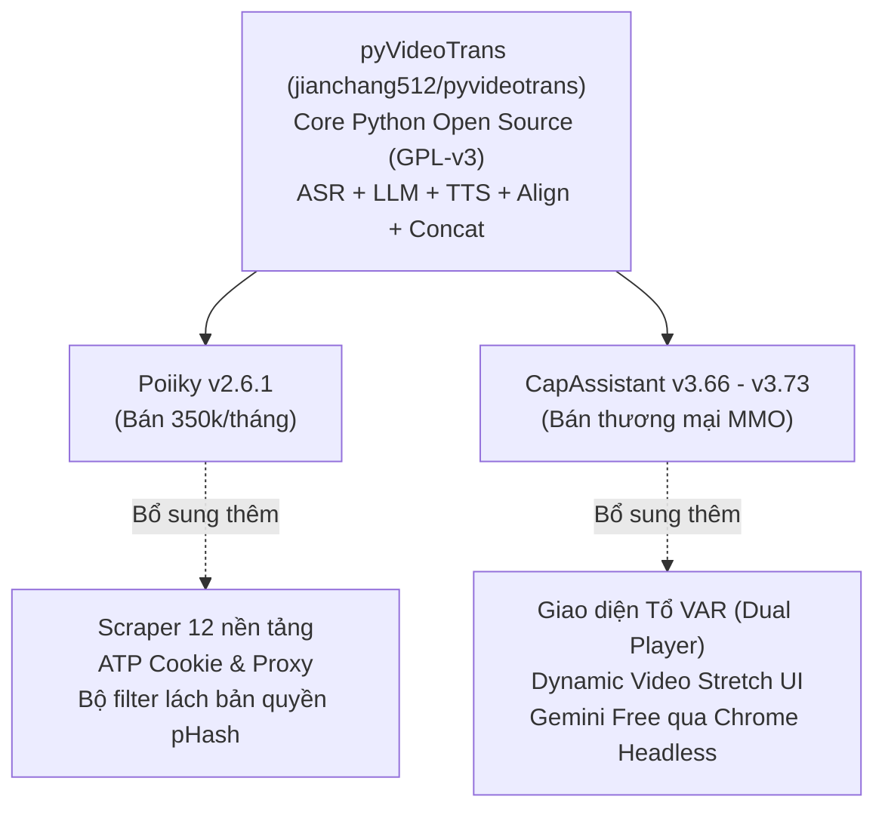

# Nghiên Cứu & Khai Thác Kỹ Thuật: pyVideoTrans v4.13, Poiiky v2.6.1 & CapAssistant v3.73

- **Ngày thực hiện**: 2026-09-21
- **Mục tiêu**: Bóc tách kiến trúc, giải thuật lõi và các nâng cấp mới nhất (v4.00 - v4.13) từ dự án gốc `pyvideotrans` và hai biến thể thương mại (`Poiiky`, `CapAssistant`), đúc kết giải pháp nâng cấp toàn diện cho Douyinie Media Workstation.
- **Tài liệu & Mã nguồn tham chiếu**:
  - Repo gốc: `.ref/pyvideotrans/` (commit `a8b76ea`, tag `v4.13`, 2026-09-20).
  - Tài liệu kỹ thuật: `.ref/pyvideotrans/docs/architecture.md`, `.ref/pyvideotrans/docs/Synchronize.md`.
  - Đặc tả hệ thống Douyinie: `docs/architecture/acquisition-and-anti-detection-spec.md`.
  - Bộ chứng cứ hình ảnh: `docs/assets/poiiky/` (18 ảnh) và `docs/assets/capassistant/` (23 ảnh).

---

## 1. Nguồn Gốc Phả Hệ (Lineage) & Sự Thật Thị Trường

Qua rà soát mã nguồn và kiểm chứng thực tế, hệ sinh thái các tool MMO/Reup video hiện nay có quan hệ phả hệ rõ ràng:



- **Lõi xử lý đa phương tiện**: 100% logic tách vocal, VAD, ASR, dịch thuật, tổng hợp giọng nói, và giải thuật co giãn âm thanh/hình ảnh đều bắt nguồn từ `pyvideotrans/videotrans/task/`.
- **Poiiky**: Thay đổi giao diện sang Electron/Vue, bổ sung module cào video (Scraper) và bộ lọc video/audio filter chống Content ID.
- **CapAssistant**: Giữ lại gần như toàn bộ flow của pyvideotrans, bổ sung giao diện đối chiếu 2 màn hình ("Tổ VAR") và cơ chế gọi session Chrome vào Google AI Studio để miễn phí chi phí dịch thuật.

---

## 2. Kiến Trúc 9 Giai Đoạn Của pyVideoTrans v4.13

Khác với kiến trúc phân tách nghiêm ngặt của Douyinie (`RuntimeHost` Go + `StageWorker` Python qua NDJSON IPC), `pyvideotrans` tổ chức theo dạng **đa luồng đa hàng đợi (Multi-thread Queue Pipeline)** trong một tiến trình Python duy nhất:

```
[Video Input]
    │
    ▼ ① Prepare (Tách audio 16kHz, tách vocal UVR, tạo folder cache)
    │
    ▼ ② Recogn (Whisper ASR, VAD cut, khôi phục dấu câu, LLM sửa lỗi)
    │
    ▼ ③ Diariz (Phân vai người nói CAM++ / pyannote / Moss-Diarize)
    │
    ▼ ④ Trans (Dịch thuật phụ đề LLM với prompt 1-to-1)
    │
    ▼ ⑤ Dubbing (TTS đa luồng theo speaker, voice clone reference cut)
    │
    ▼ ⑥ Align (SpeedRate: Nuốt khoảng lặng, Audio Rubberband, Video PTS)
    │
    ▼ ⑦ Recogn2Pass (Faster-Whisper nghe lại TTS để căn sub chuẩn 100%)
    │
    ▼ ⑧ Assembling (FFmpeg gộp video novoice + audio mix + burn sub)
    │
    ▼ ⑨ TaskDone (Di chuyển file đích, dọn dẹp cache, notification)
```

---

## 3. Chín Giải Thuật & Kỹ Thuật Cốt Lõi Khai Thác Được

### 3.1 Thuật toán Co Giãn Thời Gian & Chống Desync (`videotrans/task/_rate.py`)

Đây là lời giải hoàn chỉnh nhất cho bài toán lệch pha thời gian giữa tiếng Việt và tiếng Trung:

1. **Kỹ thuật Nuốt Khoảng Lặng (Gap Absorption)**:
   - Trước khi co giãn, mở rộng mốc kết thúc (`end_time`) của câu $i$ chạm vào mốc bắt đầu (`start_time`) của câu $i+1$.
   - Tận dụng triệt để khoảng lặng tự nhiên giữa 2 câu nói. Nhờ đó, 70% các câu thoại tiếng Việt dài hơn tiếng Trung được giải quyết mà **không cần can thiệp vào tốc độ video hay âm thanh**.
2. **Quy tắc Chia Đôi Độ Lệch (50/50 Joint Allocation)**:
   - Nếu tỷ lệ $\text{TTS} / \text{Source} \le 1.2$ (vượt $\le 20\%$): Giữ nguyên tốc độ video, chỉ tăng tốc audio bằng `pyrubberband` (hoặc FFmpeg `atempo`).
   - Nếu tỷ lệ $> 1.2$: Cả video và audio cùng gánh một nửa độ lệch:
     $$\text{JointTarget} = \text{SourceDuration} + \frac{\text{TTSDuration} - \text{SourceDuration}}{2}$$
     - Video được làm chậm lại: `-vf "setpts=(JointTarget/SourceDuration)*PTS"`.
     - Audio được tăng tốc co về đúng `JointTarget`.
3. **Mã hóa All-Intra Chống Lệch Khung Hình (`-g 1`)**:
   - Khi cắt nhỏ video thành hàng chục clip để làm chậm cục bộ, nếu video có B-frame hoặc GOP dài thì khi ghép lại (`concat demuxer`) chắc chắn sẽ bị lệch hình/tiếng.
   - `_rate.py` ép `-g 1` (mỗi frame là 1 keyframe độc lập) và `-fps_mode vfr`, đảm bảo độ chính xác tuyệt đối tới từng frame khi ghép nối.
4. **Kéo Dài Video Ở Đoạn Kết Bằng Freeze-Frame (`tpad`)**:
   - Nếu tổng thời lượng audio lồng tiếng vẫn dài hơn video gốc vài giây ở câu cuối, hàm `_video_extend` dùng bộ lọc:
     `-vf "tpad=stop_mode=clone:stop_duration=X"`
     Lệnh này giữ đứng yên khung hình cuối cùng, tránh tình trạng cụt tiếng.

---

### 3.2 Kỹ Thuật Dịch 1-to-1 & Cầu Nối Ba Chấm (`prompts/srt/deepseek.txt`)

Lý do các hệ thống dịch thông thường làm vỡ timeline khi lồng tiếng là vì LLM tự ý gộp câu hoặc đảo trật tự ngữ pháp xuyên block.

Bộ prompt chuẩn trong `pyvideotrans` đặt ra các luật bất khả xâm phạm:
- **Zero-Shift Fragment Translation**: Dịch cục bộ trong từng block. Từ ngữ ở block 1 ở nguyên block 1, từ ngữ ở block 2 ở nguyên block 2. Tuyệt đối không đảo ngữ pháp xuyên block.
- **Punctuation Bridging (Cầu Nối Ba Chấm `...`)**:
  - Nếu câu thoại bị ngắt lửng ở block 1, câu dịch block 1 bắt buộc kết thúc bằng `...`.
  - Block 2 tiếp nối bắt buộc mở đầu bằng `...`.
  - **Tác dụng kỳ diệu với TTS**: Khi gặp dấu `...` ở cuối block 1, mô hình TTS hiểu rằng câu nói chưa kết thúc nên **giữ nguyên cao độ (pitch sustain)**, không hạ giọng như dấu chấm. Sang block 2, TTS tiếp tục đọc với ngữ điệu tự nhiên, tạo cảm giác liền mạch dù bị ngắt làm 2 file audio riêng biệt.
- **Khống Chế Độ Dài Theo Thời Gian**:
  $$\text{Số ký tự tối đa} = (\text{End} - \text{Start}) \times 18.2$$
  Ép LLM chủ động lược bỏ từ đệm, từ thừa để câu dịch vừa khít thời lượng.

---

### 3.3 Bước Ngoặt v4.12: LLM Post-Edit Thay Vì LLM Re-Segmenting (`prompts/resegment/llm.txt`)

- **Kinh nghiệm xương máu của pyvideotrans**: Trước bản v4.12, việc cho LLM tự chia lại câu (re-segment) thường xuyên làm thay đổi số dòng và mốc thời gian của phụ đề, dẫn đến mất đồng bộ toàn bộ pipeline.
- **Từ bản v4.12 trở đi**: Chuyển hẳn sang cơ chế `ASR Post-Editor`:
  - **Zero Structural Changes**: Tuyệt đối giữ nguyên 100% index và timestamp của từng câu từ Whisper.
  - LLM chỉ sửa từ đồng âm, lỗi nhận diện phát âm sai và khôi phục dấu câu ngữ cảnh.

---

### 3.4 Nhận Diện 2 Lượt Căn Phụ Đề Chuẩn Xác (`recogn2pass`)

- Nếu lấy mốc thời gian của tiếng Trung gán cho phụ đề tiếng Việt, chữ phụ đề trên màn hình sẽ xuất hiện không khớp với giọng lồng tiếng (tiếng Việt nói nhanh hơn hoặc chậm hơn).
- **Giải pháp 2-Pass**:
  1. Lượt 1: Dịch và tổng hợp file audio tiếng Việt hoàn chỉnh.
  2. Lượt 2: Chạy `faster-whisper large-v3-turbo` nghe lại chính file audio tiếng Việt đó để xuất ra file SRT mới.
  3. Phụ đề tiếng Việt hiển thị trên video thành phẩm sẽ **khớp từng mili-giây với giọng đọc lồng tiếng**.

---

### 3.5 Tách Vocal Siêu Nhẹ Bằng `sherpa-onnx` UVR (`videotrans/process/_audio_separate.py`)

- Thay vì bắt buộc người dùng cài PyTorch + Demucs cồng kềnh (tốn 4GB-6GB VRAM), `pyvideotrans` tích hợp sẵn mô hình ONNX: `UVR-MDX-NET-Inst_HQ_4.onnx` thông qua engine `sherpa-onnx`.
- Xử lý tách vocal và nhạc nền siêu tốc trên CPU hoặc DirectML, tốn dưới 1GB RAM, hoạt động hoàn hảo trên máy văn phòng không có GPU rời.
### 3.6 Tự Động Bóc Tách Âm Thanh Mẫu Cho Voice Cloning (`_create_ref_from_vocal`)

- **Vấn đề**: Các mô hình Zero-shot Voice Cloning (như CosyVoice3, F5-TTS, GPT-SoVITS) bắt buộc phải có 3-5 giây audio mẫu (`ref_wav`) của nhân vật. Việc bắt người dùng tải lên từng file mẫu thủ công làm gãy quy trình tự động hóa 1-click.
- **Giải pháp của pyvideotrans**:
  - Tách trước một luồng audio chất lượng cao 44.1kHz mono từ video gốc.
  - Sau khi ASR và Diarization xác định được các đoạn thoại của từng người nói (`[S01]`, `[S02]`), hàm `_create_ref_from_vocal` dùng đa luồng (`ThreadPoolExecutor`) cắt chính xác đoạn vocal sạch (`ss=startraw`, `to=endraw`) để gán làm `ref_wav` cho nhân vật đó.
  - Mô hình TTS clone giọng trực tiếp từ chính giọng gốc của nhân vật trong video mà **không cần bất kỳ tương tác thủ công nào**.

---

### 3.7 Bảng Thuật Ngữ Chuyên Ngành (Domain Glossary Injection)

- **Vấn đề**: Video Douyin/TikTok chứa rất nhiều tiếng lóng mạng, thuật ngữ MMO, tên riêng sản phẩm hoặc thương hiệu (CapCut, Taobao, Poiiky, Kuaishou). LLM dịch thuật thông thường hay dịch word-by-word ngớ ngẩn (ví dụ: "上帝视角" dịch thô thành "góc nhìn của thượng đế" thay vì "góc nhìn thứ ba / góc nhìn toàn cảnh").
- **Giải pháp của pyvideotrans**:
  - Hỗ trợ file cấu hình `glossary.txt` dạng `từ_gốc=từ_dịch`.
  - Hàm `help_misc.py:qwenmt_glossary` tự động parse và chuyển thành bảng Markdown:
    ```markdown
    # Glossary of terms
    Translations must strictly follow this glossary. If a term appears, use this exact translation:
    | Glossary | Translation |
    | --------- | ----- |
    | 上帝视角 | góc nhìn bao quát |
    | 搬运 | reup / bòn rút traffic |
    ```
  - Bảng này được inject thẳng vào placeholder `{GLOSSARY_DICT}` trong system prompt của LLM.

---

### 3.8 Tự Động Tăng Tốc Render Bằng GPU Hardware (`_get_hard_cfg`)

- **Vấn đề**: Quá trình render xuất video cuối cùng (ghép video, mix nhạc nền, burn phụ đề ASS/SRT) ngốn CPU khủng khiếp và mất nhiều phút nếu chỉ dùng `libx264`.
- **Giải pháp của pyvideotrans**:
  - Hàm `_get_hard_cfg` tự động probe phần cứng để chọn codec tối ưu:
    - NVIDIA: `h264_nvenc` / `hevc_nvenc` với `-cq 23 -preset p4`, bật `-hwaccel cuda` nếu có GPU.
    - Intel: `h264_qsv` (`-global_quality 23`).
    - AMD: `h264_amf` (`-rc cqp`).
    - Apple: `h264_videotoolbox`.
  - Render bằng NVENC trên GPU chuyên dụng (như RTX 2060 SUPER) nhanh hơn 5x - 10x so với CPU `libx264`.

---

### 3.9 Kỹ Thuật Giữ 100% Âm Lượng Vocal Khi Mix BGM (`normalize=0` & `alimiter`)

- **Vấn đề**: Trong FFmpeg, filter `amix=inputs=2` mặc định sẽ áp dụng công thức chia đều âm lượng $1/N$ ($1/2 = -6\text{dB}$ cho mỗi luồng). Kết quả là khi chèn nhạc nền vào, giọng lồng tiếng bị sụt giảm 50% âm lượng, trở nên lí nhí và chìm nghỉm.
- **Giải pháp của pyvideotrans**:
  ```bash
  -filter_complex "[0:a][1:a]amix=inputs=2:duration=first:dropout_transition=2:normalize=0,alimiter=limit=0.95:level=0"
  ```
  - `normalize=0`: Giữ nguyên vẹn 100% âm lượng của giọng lồng tiếng, không bị suy hao.
  - `alimiter=limit=0.95:level=0`: Chặn đứng hiện tượng méo tiếng/bể tiếng (audio clipping) khi tổng biên độ của vocal và nhạc nền vượt ngưỡng $0\text{dB}$.
  - `dropout_transition=2`: Làm mượt 2 giây ở đoạn chuyển tiếp khi một luồng âm thanh kết thúc.

---

## 4. Đề Xuất Áp Dụng Nâng Cấp Douyinie

Douyinie vốn đã vượt trội hơn `pyvideotrans` ở khâu **Inpainting xóa sạch 100% phụ đề gốc Trung Quốc** và **Diarization phân vai nhân vật tự động**. Việc bổ sung các kỹ thuật của `pyvideotrans` sẽ đưa Douyinie lên vị thế hoàn hảo:

| Khu vực nâng cấp | File cần can thiệp trong Douyinie | Giải pháp kỹ thuật áp dụng |
| :--- | :--- | :--- |
| **Dịch thuật phụ đề** | `internal/provider/gateway_translation.go` | Bổ sung luật **Cầu Nối Ba Chấm (`...`)**, trần đọc **18.2 ký tự/giây**, và inject **Bảng Thuật Ngữ (Glossary Table)** vào prompt của Gemini/DeepSeek. |
| **Khắc phục Overrun** | `internal/service/dubbing.go` & `internal/media/mix.go` | Thêm bước **Gap Absorption** (nuốt khoảng lặng câu sau). Bổ sung tùy chọn **Tail Freeze-Frame (`tpad`)** kéo dài khung hình cuối nếu audio tiếng Việt câu chốt dài hơn hình. |
| **Khớp phụ đề 100%** | `internal/service/dubbing.go` | Bổ sung stage tùy chọn **2-Pass Subtitle Sync** (dùng Whisper chạy nhanh trên audio lồng tiếng để căn lại timestamp phụ đề tiếng Việt). |
| **Tự động Voice Clone** | `internal/provider/tts_cosyvoice.go` | Trích xuất tự động `ref_wav` 44.1kHz từ clean vocal stem của từng speaker để CosyVoice3 clone chuẩn xác âm sắc nhân vật mà không cần nạp file ngoài. |
| **Tăng tốc Render** | `internal/media/render.go` | Tích hợp hardware probe: sử dụng `h264_nvenc` với `-cq 23 -preset p4` khi phát hiện GPU NVIDIA, giúp render nhanh gấp 5x-10x. |
| **Kiểm duyệt trực quan** | `internal/server/ui/` | Tích hợp giao diện **Tổ VAR (Dual-player Sync Seek)** vào trang Review Inspector. |
| **Phá bản quyền Reup** | `internal/media/antidetect_filter.go` | Bổ sung bộ lọc FFmpeg filter graph: lật gương, zoom 110%, micro-speed 90%, film grain, micro pitch shift $\pm 1.2\%$. |
| **Tách vocal máy yếu** | `cmd/stageworker/adapters/` | Bổ sung adapter nhẹ chạy `sherpa-onnx` với model UVR ONNX dự phòng cho Demucs. |
